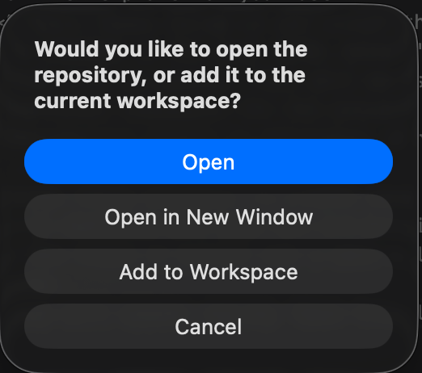

# Get setup

## Installing the pre-requisites

We suggest you use Visual Studio Code with appropriate plugins. Complete the following steps.

1. Start with installing [Visual Studio Code](https://code.visualstudio.com/)
2. Install [GitLab plugin](https://marketplace.visualstudio.com/items?itemName=GitLab.gitlab-workflow) in Visual Studio Code. This will enable you manage your documentation in GitLab.
3. Install [markdownlint](https://marketplace.visualstudio.com/items?itemName=DavidAnson.vscode-markdownlint) plugin for Visual Studio Code. This is designed to check your markdown files against a library of rules to encourage standards and consistency.
4. Connect Visual Studio Code with GitHub using HTTPS.  TODO

## Initialise your documentation website

1. Create a directory for all your GitLab projects on your local desktop. For example, create a directory called 'gitlab' on your OneDrive. Using OneDrive will give you another backup of your gitlab repository.
2. [Fork a copy of the template](https://gitlab.surrey.ac.uk/mb0105/doc-template/-/forks/new) to create a copy of the template for your use.
3. Enter the *Project name* using to the format the coursework specifies. For example, for Coursework 1 for the module COMM058 in the year 2026, enter 'comm058-coursework1-2026'. Use all lowercase and a dash between words with no spaces. This will be used to create the project URL.
4. Select your personal namespace for the project URL.
5. Change the *Visibility Level* to *Private*.

    !!! Warning
        Don't forget to set the visibility to private, otherwise other students can see your coursework. As another student to check whether they can see your site.

6. Press the button [Fork Project] to create your own copy of the project.
7. Next we need to download and copy the project into Visual Studio Code so you can work with it locally. Select the [Code v] button and a menu will come up. Select the HTTPS button to the right of Visual Studio Code.
8. A browser popup will appear saying 'Open Visual Studio Code?' and you push the [Open Visual Stdio Code] button.
9. This will open a directory selection box. Go to the 'gitlab' directory you selected earlier and press the [Select as Repository Destination]. This will then download the code to a subdirectory with the name of the project you created earlier.

    <figure markdown="span">
      { width="600" }
      <figcaption>Directory selection</figcaption>
    </figure>

10. Then you will be prompted to open your repository that is stored in your 'gitlab' directory. If you already have Visual Studio Code, you may wish to select [Open in a new window] so it creates a seprate window to your current workspace.

    <figure markdown="span">
      { width="200" }
      <figcaption>Open repository</figcaption>
    </figure>

## Perform initial configuration

1. The zensical.toml file contains the configuration for your website.

10. Make sure all your files have been saved. Any that are unsaved have a filled circle against the file name. Go to the file and press Ctrl-S/Cmd-S.

## Synchronise your updates

1. Click on the [Source Control] icon (third one down) on the left in Visual Studio Code and you will see a list of all the files that have been changed and created.

    <figure markdown="span">
      { width="300" }
      <figcaption>Initial commit</figcaption>
    </figure>

2. Fill into the Message box short description of the change. In this case, enter 'Initial Commit' as this is the first commit of the code to GitLab.
3. Then press the [Commit] button.

## View your initial website

https://mb0105.pages.surrey.ac.uk/comm058-coursework1-2026/