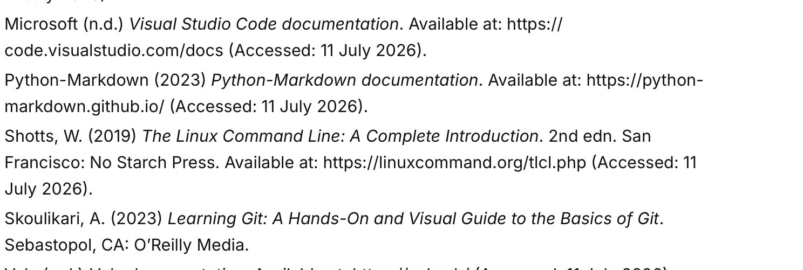
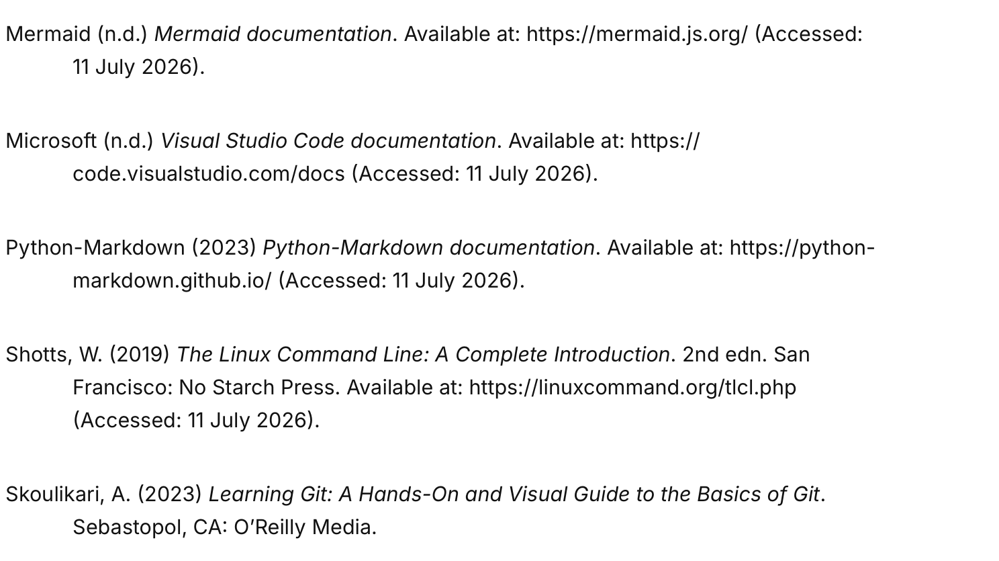
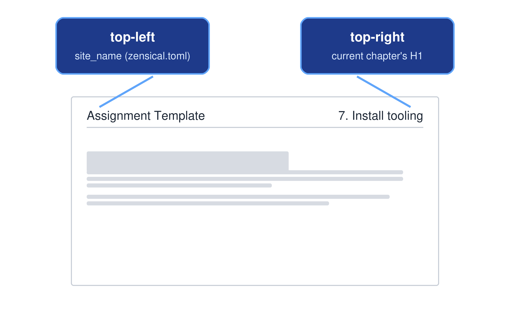
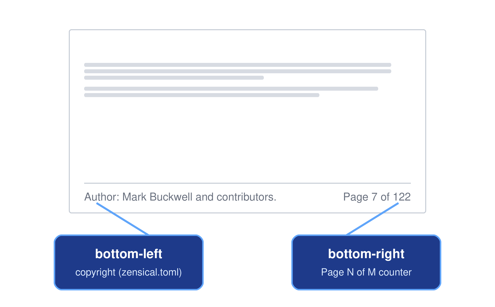
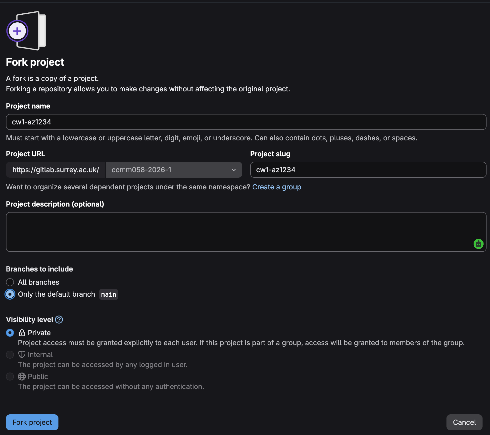
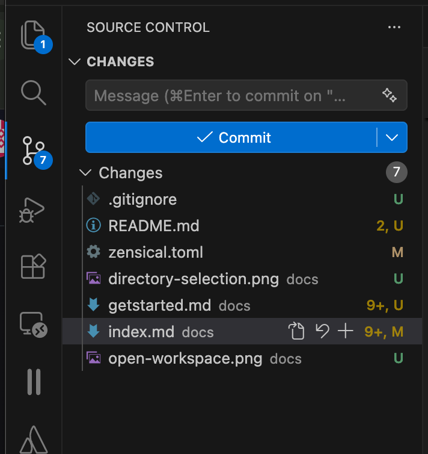

<!-- 
# Copyright (c) 2025-2026 Mark Buckwell and contributors
# SPDX-License-Identifier: MIT
-->

{{ heading_counter_reset(page) }}

# Customisation

A small number of files control almost every visible part of this template - the website, the cover page, and the generated PDF: `zensical.toml` for configuration, `macros.py` for build-time logic, and `docs/stylesheets/extra.css`/`print.css` for appearance. This section walks through each of these in turn: customising the website's branding and behaviour, restructuring the document itself, customising the cover page, and adjusting the PDF's page layout. It ends with a full map of the template's directory structure, so you know where everything lives.

!!! info "zendoc-specific features"
    Where [Zensical basics](zensicalbasics.md) is a quick reference for Zensical's own general-purpose Markdown extensions (the same ones you'd find on any Zensical site), everything on this page is specific to this template: features `macros.py` and `build_pdf.py` add on top of Zensical (heading numbering, the references page pattern, Surrey/generic branding, PDF-only/web-only content, and so on) that only exist here, not in a stock Zensical project.

## Customise the web site

Most website-wide settings live in `zensical.toml`, in the `[project]` and `[project.theme]` sections. The sections below describe the most commonly customised ones; see the [Zensical setup documentation](https://zensical.org/docs/setup/) for the full reference.

### Site logo

If the documentation website is part of the university's GitLab service, or the website's location falls under the University of Surrey domain, the build automatically changes the site logo to the University of Surrey logo. Otherwise, the site logo uses the default logos in the `docs/assets/` directory. You can change the default logo by replacing the existing default logo files with your own logo files named `logo_default_black.png` and `logo_default_white.png`.

Every build, and `zensical serve`, copies either the Surrey pair or your default pair over `docs/assets/logo_black.png`/`logo_white.png` - the two files `extra.css` actually references for the light/dark logo swap. Don't edit `logo_black.png`/`logo_white.png` directly, since the next build overwrites them.

### Site metadata

`site_name`, `site_description`, `site_author`, and `site_url` (all in `[project]` in `zensical.toml`) set the browser tab title, the HTML description used by search engines, the HTML author metadata, and the canonical site URL. `site_name` is also shown on the [cover page](#site-name).

### Copyright

`copyright` in `[project]` sets the text shown in the website's footer. It can contain an HTML fragment, for example an `&copy;` entity:

```toml
copyright = """
Copyright &copy; 2026 Your Name
"""
```

The PDF build reuses this same setting for its own running footer - see [Page footer](#page-footer).

### Repository link

`repo_url` and `repo_name` in `[project]` show a link to your repository, with an icon and short name, near the top of the sidebar:



```toml
repo_url = "https://gitlab.surrey.ac.uk/mb0105/zendoc-template"
repo_name = "zendoc-template"
```



```toml
repo_url = "https://github.com/buckwem/zendoc-template"
repo_name = "zendoc-template"
```



You set the icon shown next to it separately - see `theme.icon.repo` under [Icons](#icons).

!!! note
    This is unrelated to the `{{ repo_url }}` macro variable used on the cover page (see [Word count and repository link](#word-count-and-repository-link)). The build computes that value independently from your local Git remote, rather than reading it from this `repo_url` setting, though in practice they'll usually point to the same place.

### Favicon

Set `favicon` in `[project.theme]` to a path (relative to `docs_dir`) for your own browser-tab icon:

```toml
[project.theme]
favicon = "images/favicon.png"
```

Left unset, Zensical uses its default favicon.

### Colour Scheme

The two `[[project.theme.palette]]` blocks in `zensical.toml` configure the light and dark themes and the toggle button between them:

```toml
[[project.theme.palette]]
media = "(prefers-color-scheme: light)"
scheme = "default"
toggle.icon = "lucide/sun"
toggle.name = "Switch to dark mode"

[[project.theme.palette]]
media = "(prefers-color-scheme: dark)"
scheme = "slate"
toggle.icon = "lucide/moon"
toggle.name = "Switch to light mode"
```

`scheme` selects Zensical's built-in `default` (light) or `slate` (dark) palette; `toggle.icon`/`toggle.name` set the icon and tooltip for the button used to switch between them.

### Page Heading

The website's header background image swaps between light and dark mode too, in `docs/stylesheets/extra.css`:

```css
[data-md-color-scheme="default"] .md-header {
  background: ... url("../assets/header-background.jpg");
}
[data-md-color-scheme="slate"] .md-header {
  background: ... url("../assets/header-background-dark.jpg");
}
```

Replace `header-background.jpg`/`header-background-dark.jpg` in `docs/assets/` with your own images, or switch to a plain colour gradient instead - `extra.css` has a commented-out example of this directly below.

### Fonts

`[project.theme.font]` in `zensical.toml` sets the fonts loaded from Google Fonts, used across the website:

```toml
[project.theme.font]
text = "Inter"
code = "Jetbrains Mono"
```

Use `text` for body copy and headings, and `code` for code blocks and inline code. Both default to Inter and JetBrains Mono if you leave this section unset. The PDF build reuses this same setting - see [Customise PDF generation](#customise-pdf-generation).

### Icons

`[project.theme.icon]` sets the icons used for the edit/view/repository buttons in the header, and `[project.theme.icon.admonition]` sets the icon shown for each admonition type (`note`, `warning`, `tip`, and so on):

```toml
[project.theme.icon]
edit = "lucide/pencil"
view = "lucide/eye"
repo = "fontawesome/brands/gitlab"

[project.theme.icon.admonition]
note = "fontawesome/solid/note-sticky"
warning = "fontawesome/solid/triangle-exclamation"
```

You can use any [Lucide or FontAwesome icon name](https://zensical.org/docs/authoring/icons-emojis/#search).

### Navigation and feature toggles

The `features` list in `[project.theme]` turns individual website behaviours on or off - instant navigation, sticky tabs, search highlighting, the back-to-top button, and around twenty others. `zensical.toml` lists each one with a link to its own documentation in a comment directly above it; comment a line out to disable that feature, or uncomment one of the already-listed-but-disabled options to enable it.

### Extra CSS and JavaScript

`extra_css` and `extra_javascript` in `[project]` list additional stylesheets and scripts to load, with paths relative to `docs_dir`:

```toml
extra_css = ["stylesheets/extra.css"]
extra_javascript = [
  "https://unpkg.com/mathjax@3/es5/tex-mml-chtml.js",
  "javascript/extra.js"
]
```

[`docs/stylesheets/extra.css`](../stylesheets/extra.css) is where most of this template's own customisations live (the logo swap, header image, cover page title styles, and the `.pdf-only`/`.web-only` markers).

### Social links

Add icons linking to your social profiles or other sites in the footer, by uncommenting and repeating this block in `[project.extra]` in `zensical.toml`:

```toml
[[project.extra.social]]
icon = "fontawesome/brands/github"
link = "https://github.com/user/repo"
```

## Customise doc structure

The `nav` list in `zensical.toml` and the heading numbering setting below control how your document is broken into pages, the order they appear in, and how they're numbered. Both apply identically to the website's sidebar and the generated PDF.

### Navigation structure

`nav` (under `[project]` in `zensical.toml`) lists, in order, every page in your document and how they're grouped. Here's this template's own `nav`, right now, as an example - it's pulled directly from `zensical.toml` and updates automatically as you edit it, so it always matches what's actually configured:

```toml
{{ nav_snippet() }}
```

Each entry is either a plain path to a markdown file, or a `{"Group name" = [...]}` block nesting further entries - top-level groups become tabs, and nested groups become collapsible sections in the sidebar. This same `nav` list, walked in this same order, is also what `build_pdf.py` uses to decide which files go into the PDF and in what order - so reordering, adding, or removing an entry here changes both outputs at once.

To add a new page: create the markdown file under `docs/`, then add its path to `nav` wherever you want it to appear (remembering the one-heading-1-per-file rule below).

### Changing heading numbering

By default, this documentation template enables heading numbering. If you want to disable heading numbering, you can do so by adding the following line to the `[project.extra]` section of the `zensical.toml` file:

```toml
heading_numbering = false
```

This will also disable heading numbering in the generated PDF output. If you want to enable heading numbering again, simply set the value to `true`:

```toml
heading_numbering = true
```

The top level heading numbering shown in the sidebar isn't generated automatically - it's typed directly into each entry's title in `nav`, matching the pattern of the ones already there, for example:

```toml
{"6. Case Study" = "casestudy.md"}
```

Keep the numbers in each title sequential as you add, remove, or reorder chapters - inserting a new entry partway through (as above, right after "5. Section") means renumbering every entry after it, since (unlike the in-page heading numbers) `nav` doesn't renumber these for you.

!!! note
    Appendix pages are the one exception - see [Appendixes](#appendixes) below - since they're lettered rather than numbered, and don't take a number from this sequence at all.

!!! warning
    Each markdown file can contain only one heading 1 (`#`). Zensical numbers headings sequentially across the whole document in `nav` order, starting a new top-level number at each heading 1 - a second heading 1 in the same file breaks that numbering and confuses the table of contents. If you need another top-level heading, create a new markdown file for it and add it to `nav` instead.

### References and bibliography

Zensical doesn't include a dedicated citation or bibliography extension, but you can build a simple one using a references page.

!!! info "How the PDF handles this"
    The [attribute list](https://zensical.org/docs/authoring/formatting/#attribute-lists) syntax below is understood natively by the live website, but Pandoc (which builds the PDF) doesn't recognise it, and would otherwise leave `{: #id }` sitting in the output as literal, visible text. This template translates it automatically, so you can write the same plain attr_list Markdown below and both outputs render correctly - no manual HTML needed.

1. Create a page for your sources (this template includes one at [`docs/references.md`](../references.md)). List each source as a paragraph, and give it a short, unique id using attr_list syntax on the line directly below it (no heading needed - attr_list works on plain paragraphs too):

    ``` markdown
    Skoulikari, A. (2023) *Learning Git: A Hands-On and Visual Guide to the Basics of Git*. Sebastopol, CA: O'Reilly Media.
    {: #skou2023 .reference }
    ```

    Each entry needs a blank line before and after it - attr_list only recognises `{: ... }` as an id (rather than literal visible text) when it's the last line of its own paragraph. Removing the blank lines to save space merges entries into one paragraph and breaks both outputs.

2. Add the page to `nav` in `zensical.toml` so it appears in the sidebar - as a regular numbered chapter, or as a lettered appendix (see [Appendixes](#appendixes) below). This template ships it as an appendix by default.
3. Cite the source in-text by linking to that paragraph's id, wrapping the link in an extra pair of square brackets so it reads like an in-text citation:

    ``` markdown
    Git is a tool used to manage version control.[[Skoulikari, 2023](references.md#skou2023)]
    ```

    Which renders as: Git is a tool used to manage version control.[[Skoulikari, 2023](../references.md#skou2023)]

    (The path here is `../references.md` rather than `references.md` because this page lives in `docs/starthere/` - from `docs/section1.md` itself, `references.md` is correct, as shown in the code block above.)

    !!! warning
        In-text citation links like this resolve correctly on the website, but internal cross-page links generally don't resolve to the right place within the built PDF (a pre-existing limitation of this template's Pandoc-based PDF pipeline, not specific to references) - the link ends up pointing at a local file path rather than jumping to the anchor.

4. Consecutive entries get the browser's normal spacing between paragraphs by default - noticeably looser than a typical bibliography. Give each entry's attr_list line a `.reference` class alongside its id (as shown in the code block above) so the template's layout rules - described next - can target them.

5. Set `project.extra.reference_style` in `zensical.toml` to control how `.reference` entries are laid out, on both the website and the PDF build:

    ``` toml
    [project.extra]
    reference_style = "european" # or "global"
    ```

    `"european"` (the default) - single line spacing, no indent, entries close together:

    { .screenshot }
    /// figure-caption
    European reference style
    ///

    `"global"` - double spacing between entries, with a 0.5in/1.27cm hanging indent on wrapped lines (the common APA/MLA/Chicago style):

    { .screenshot }
    /// figure-caption
    Global reference style
    ///

    !!! note
        To change the spacing or indent values themselves, edit the CSS in `docs/stylesheets/extra.css` and `build_pdf.py` - each has a comment next to its `reference_style`-related rule explaining what to change.

!!! tip
    Keep ids short and stable (e.g. `skou2023`, author surname plus year) so citations keep working even if you reorder entries on the references page later. If a page citing a source is nested in a subdirectory, adjust the relative path to `references.md` accordingly.

### Acronyms and abbreviations

Zensical doesn't include a dedicated acronym-list extension either, but you can build an acronyms page the same way as the references page above - a plain page of attr_list-anchored entries that other pages link straight into.

!!! info "How the PDF handles this"
    Like the references page, this relies on attr_list (see [References and bibliography](#references-and-bibliography) above) - Pandoc doesn't recognise it here either, and this template translates it automatically for the PDF, so the same source works correctly in both outputs.

1. Create a page for your acronyms (this template includes one at [`docs/acronyms.md`](../acronyms.md)). List each acronym as a short paragraph, and give it a short, unique id using attr_list syntax on the line directly below it, the same as a reference entry:

    ``` markdown
    **CSS** - Cascading Style Sheets
    {: #css .acronym }
    ```

    As with references, each entry needs a blank line before and after it, and the `.acronym` class is what keeps consecutive entries close together rather than using the browser's normal, looser paragraph spacing.

2. Add the page to `nav` in `zensical.toml` so it appears in the sidebar - as a regular numbered chapter, or as a lettered appendix (see [Appendixes](#appendixes) below). This template ships it as an appendix by default.
3. Link to an acronym the first time you use it in a page, the same way you'd cite a reference:

    ``` markdown
    This template uses [CSS](acronyms.md#css) to control the website's appearance.
    ```

!!! tip
    Keep ids short and lowercase (e.g. `css`, `pdf`) so links keep working even if you reorder entries on the acronyms page later.

### Glossary

You can build a glossary of key terms the same way, in its own page - this template includes one at `docs/glossary.md`, right after the acronyms page in `nav`.

!!! info "How the PDF handles this"
    Like the references and acronyms pages, this relies on attr_list too - Pandoc doesn't recognise it here either, and this template translates it automatically for the PDF, so the same source works correctly in both outputs.

1. Create a page for your glossary (this template includes one at [`docs/glossary.md`](../glossary.md)). List each term as a short paragraph, and give it a unique id using attr_list syntax, the same as a reference or acronym entry:

    ``` markdown
    **Markdown** - A lightweight markup language for formatting plain text...
    {: #markdown-def .glossary }
    ```

    Give glossary entries their own ids, distinct from any acronym ids for the same concept (for example `css-def` rather than `css`) - `build_pdf.py` concatenates every page into a single PDF document, so two entries sharing an id anywhere in the document would collide.

2. Add the page to `nav` in `zensical.toml` so it appears in the sidebar - as a regular numbered chapter, or as a lettered appendix (see [Appendixes](#appendixes) below). This template ships it as an appendix by default.
3. Link to a term the first time you use it in a page, the same way you'd cite a reference or an acronym:

    ``` markdown
    This document is written in [Markdown](glossary.md#markdown-def).
    ```

!!! tip
    If a term is also one of your acronyms, link the two entries to each other (see `docs/acronyms.md` and `docs/glossary.md` in this template for an example) rather than duplicating the explanation on both pages.

### Appendixes

Set `is_appendix: true` in a page's front matter to give its heading letter-based numbering - "Appendix A", "Appendix B", ... - instead of continuing the document's normal numbered sequence, matching the usual academic convention for appendixes. Sub-headings within an appendix page number the same way numbered sections do, just using the letter instead of a chapter number - "A.1", "A.1.1", and so on.

```markdown
---
icon: lucide/book-open
is_appendix: true
---
```

Appendix pages are lettered in `nav` order - the first `is_appendix: true` page becomes Appendix A, the second becomes Appendix B, and so on - regardless of how many numbered chapters come before them, and without taking a number away from that sequence (see the note in [Changing heading numbering](#changing-heading-numbering) above). This template ships `docs/acronyms.md`, `docs/glossary.md`, and `docs/references.md` as appendixes by default, grouped under their own "Appendixes" tab in `nav`.

!!! note
    Like the numbered chapter titles in `nav` (see [Changing heading numbering](#changing-heading-numbering)), the "Appendix A"/"Appendix B" prefix shown in the sidebar isn't generated automatically - type it directly into each entry's title in `nav`, matching the pattern already there:

    ```toml
    {"Appendix A. Acronyms" = "acronyms.md"}
    ```

!!! tip
    Appendixes conventionally don't count toward a submission's word limit either - pair `is_appendix: true` with `exclude_from_word_count: true` (see [Word count and repository link](#word-count-and-repository-link) above), as this template's own appendix pages already do.

## Customise front page

The cover page (`docs/index.md`) consists of a few independently customisable pieces, described below.

### Institution branding

A Jinja conditional block wraps the cover page's logo, colours, and introductory text:

```markdown


... Surrey-branded logo and text ...

... your own branding and text ...


```

`is_surrey` is a boolean computed once per build in `macros.py`, set to `true` if *any* of the following match:

* The build is running in GitLab CI/CD with `CI_SERVER_HOST` set to `surrey.ac.uk`.
* Your local Git repository's `origin` remote contains `surrey.ac.uk`.
* Zensical's own config (e.g. the site URL) contains `surrey.ac.uk`.

If you're not from the University of Surrey, the `` branch is where you customise your own institution or company branding: replace `Crested Eagle Labs`, `University of the World`, and `Research programmes in Cyber Security` with your own text, and point the two `` image lines at your own logo files (see [Site logo](#site-logo) above for the light/dark logo swap).

!!! tip
    `is_surrey` isn't only used on the cover page - it's also what switches the Git setup instructions in [Install tooling](installtooling.md) between `gitlab.surrey.ac.uk` and `gitlab.com`.

### PDF-only and web-only content

`.pdf-only` and `.web-only` are two general-purpose CSS marker classes. Add either to any element on any page, not just the cover page, to show it in only one output:

* `.pdf-only` - shown in the generated PDF, hidden on the live website.
* `.web-only` - shown on the live website, hidden in the generated PDF.

For static content, just add the relevant class - it looks identical either way, so hiding it from the other output is all that's needed. Computed values are different: the PDF and the website fill them in using two separate mechanisms - a `{MARKER}` placeholder substituted only during the PDF build, and a `{{ macro_variable }}` Jinja variable evaluated only by the live website - so each only works paired with its own class. The word count and repository link below are examples of this.

### Site name

The cover page also shows your project's `site_name` (from `zensical.toml`), using `{{ site_name }}`. Unlike the marker-restricted values below, this one doesn't need a `.pdf-only`/`.web-only` pair: `build_pdf.py` substitutes that exact same text directly during the PDF build (rather than a separate `{MARKER}`), so a single line works correctly in both outputs. It appears twice in `docs/index.md`, once in each half of the `is_surrey` block, styled the same way as `module_id - module_name`:

```markdown
<p class="title-ctr-b4">{{ site_name }}</p>
```

Delete both lines if you don't want the site name shown on the cover page.

### Word count and repository link

Four elements on the cover page use marker classes out of the box: the automated word count, the repository link, the latest release number, and the "Download PDF" button.

**Word count**: `.pdf-only`, shows an automated word count of your document's content (excluding the cover page itself and the Table of Contents). To remove it from the PDF, open `docs/index.md` and delete the following line:

```markdown
<p class="pdf-only">Word count: {WORDCOUNT}</p>
```

The PDF build replaces the `{WORDCOUNT}` marker with the actual count. If you delete the line, the PDF simply builds without a word count - you don't need to change anything else.

The count also skips any page whose front matter sets `exclude_from_word_count: true` - already set on `references.md`, `acronyms.md`, `glossary.md`, and `originality.md`, matching the common academic convention that a bibliography, acronym list, glossary, and originality/AI-use declaration don't count toward a submission's word limit. Add the same line to a page's own front matter (alongside `icon:`) to exclude any other page the same way:

```markdown
---
icon: lucide/book-open
exclude_from_word_count: true
---
```

**Repository link**: `.pdf-only`, shows the fully qualified URL of your project's Git repository. To remove it from the PDF, open `docs/index.md` and delete the following line:

```markdown
<p class="pdf-only">Repo: {REPOURL}</p>
```

The PDF build replaces the `{REPOURL}` marker with your repository's `origin` remote URL. If you delete the line, the PDF simply builds without a repository link - you don't need to change anything else.

**Release number**: `.pdf-only`, shows the tag of your repository's latest published GitHub or GitLab release (e.g. `v0.0.11`), so a distributed PDF can be traced back to the exact version of the source it was built from. To remove it from the PDF, open `docs/index.md` and delete the following line:

```markdown
<p class="pdf-only">Release: {RELEASE}</p>
```

The PDF build fetches the latest release from your repository host's API and replaces the `{RELEASE}` marker with its tag. Unlike word count and repository link, this only happens if a release has actually been published - most forks of this template never publish one, so by default the whole line is dropped rather than showing an empty "Release:" label. There's no website equivalent: the live site already shows the same information in its own header (next to the star/fork counts), fetched by the browser itself, so nothing needs adding to any page for that.

**To add the word count or repository link to the website**, add a line like one of the following to any page, for example next to the lines you just deleted on the cover page:

```markdown
Word count: {{ word_count }}
Repo: {{ repo_url }}
```

`{{ word_count }}` and `{{ repo_url }}` are macro variables that Zensical makes available on every page, so you can drop either into any markdown file, not just the cover page.

!!! note
    The PDF and the website calculate the word count slightly differently, so it may not always match exactly. The PDF count reflects the final, built PDF content. The website count is a rough estimate across the pages that `nav` lists in `zensical.toml` (excluding the cover page).

### Download PDF button

`.web-only`, links to the generated PDF so website visitors can download it. It isn't shown inside the PDF itself, since that would be circular. To remove it from the website, open `docs/index.md` and delete the following line:

```markdown
[:material-file-pdf-box: PDF](site_documentation.pdf){ .md-button target="_blank" style="float: right; margin-left: 15px;" .web-only}
```


## Customise PDF generation

PDF generation itself is a zendoc extension, in the same sense as the rest of this page: Zensical only builds the website, so `build_pdf.py` is this template's own build script, layered on top, that renders the same `docs/` content into a single-file PDF via [Pandoc](https://pandoc.org/) and [WeasyPrint](https://weasyprint.org/). It reuses `zensical.toml` settings wherever it can, so most website customisations (site name, copyright, fonts, and so on) apply to the PDF automatically - the sections below cover the handful of things that are PDF-specific.

For how to actually run it as part of your day-to-day writing - installing its dependencies, the `python build_pdf.py` command itself, and troubleshooting a failed build - see [Build the PDF](startediting.md#build-the-pdf) in *Start editing*; this section is about customising its output once it's already working.

`build_pdf.py` controls most of the generated PDF's page layout - the running header, the footer, the page size, and the fonts - either from `zensical.toml` settings you already use for the website, or (for page size and margins) their own PDF-only `zensical.toml` settings.

### Page header

Every page except the cover shows a running header: your project's `site_name` (from `zensical.toml` - see [Site name](#site-name)), left-aligned, with a divider line underneath. There's no separate PDF setting for it - editing `site_name` in `zensical.toml` updates the header everywhere, including the website.

The header also shows the current chapter title, right-aligned - starting from the first numbered heading 1, so it's blank on the cover page and the Table of Contents. `build_pdf.py` computes it automatically from each page's heading 1 (including its chapter number), so there's nothing to configure here either.


/// figure-caption
PDF page header layout
///

### Page footer

Every page except the cover also shows a running footer: your `copyright` text (left-aligned - see [Copyright](#copyright)) and a "Page X of Y" counter (right-aligned).


/// figure-caption
PDF page footer layout
///

The cover page (`docs/index.md`) never shows this header or footer at all - see the note at the end of [Page size and margins](#page-size-and-margins) below.

### Page size and margins

Set `project.extra.pdf_page_size` and `project.extra.pdf_margin_top`/`pdf_margin_right`/`pdf_margin_bottom`/`pdf_margin_left` in `zensical.toml`:

```toml
[project.extra]
pdf_page_size = "A4"
pdf_margin_top = "2cm"
pdf_margin_right = "2cm"
pdf_margin_bottom = "2cm"
pdf_margin_left = "2cm"
```

`pdf_page_size` accepts any standard CSS page size (e.g. `letter`, `legal`, `A3`) or explicit dimensions (e.g. `21cm 29.7cm`), optionally followed by `landscape`. Each `pdf_margin_*` setting accepts any valid CSS length (e.g. `2cm`, `0.75in`) and can differ from the others - useful for, say, extra left margin for binding, or matching an institution's own asymmetric submission template. The header and footer live inside this margin, so shrinking a side also narrows the space available to them there. All five default to the values shown above if left unset, and none of them affect the live website.

The PDF also reuses your website's theme fonts (body copy, headings, and the header/footer) - see [Fonts](#fonts) above for the `zensical.toml` setting.

!!! note
    The cover page (`docs/index.md`) never shows the running header or footer, and heading numbering (e.g. "11.4") is a separate setting - see [Changing heading numbering](#changing-heading-numbering).

### Captions

The [attribute list](https://zensical.org/docs/authoring/formatting/#attribute-lists)-based `<figure>`/`<figcaption>` pattern in [Zensical basics](zensicalbasics.md#images) works for images, but this template also enables `pymdownx.blocks.caption`, a `/// caption ... ///` block that captions *either* an image *or* a table, auto-numbers itself, and - unlike the `<figure>` approach - works correctly in the PDF too.

!!! info "How the PDF handles this"
    Pandoc doesn't understand `pymdownx.blocks.caption` syntax at all - including its own auto-numbering, which is computed by the Python-Markdown extension the website runs and Pandoc never does. This template translates the block into something Pandoc understands for the PDF, and separately computes the same `<chapter>.<n>` numbers the website shows, so the same source works - and numbers the same way - in both outputs.

This template configures three caption types under `[project.markdown_extensions.pymdownx.blocks.caption]` in `zensical.toml`:

1. **`caption`** - plain and unnumbered, for an image that doesn't need a "Figure N" label - a decorative image or an institution logo, rather than a screenshot or diagram that's part of the document's actual content:

    ``` markdown
    
    /// caption
    Institution logo
    ///
    ```

2. **`figure-caption`** - auto-numbered "Figure `<chapter>.<n>`" (e.g. "Figure 9.1"), attached to the image immediately before it. `<chapter>` is wherever this page ends up in `nav`; `<n>` auto-increments per page - reordering chapters, or adding another figure to the page, never needs a manual renumber:

    ``` markdown
    { width=70% .screenshot }
    /// figure-caption
    GitLab fork project
    ///
    ```

3. **`table-caption`** - the same auto-numbering, but for a table, shown *below* it by default - just like a figure. Add `| <` after the type name to show it *above* the table instead, genuinely repositioned in both outputs rather than just a CSS visual trick; this template uses this for every table caption of its own (see [Fork and cloning the zendoc-template](installtooling.md#fork-and-cloning-the-zendoc-template) for a real example):

    ``` markdown
    | Feature | Fork | Clone |
    |----|----|---|
    | ... |
    /// table-caption | <
    Fork and Clone Comparison at a Glance
    ///
    ```

The caption block always comes *after* the image or table it captions, regardless of where it's actually shown - `pymdownx.blocks.caption` attaches to whichever element immediately precedes it.

!!! tip
    Force a specific number instead of the auto-incrementing one with `| 5` (later auto-numbers on the same page continue counting up from there, never going backwards); give a caption a stable custom id instead of the auto-generated one with `| #my-id`; add an extra CSS class with `| #my-id.my-class`. Combine modifiers with spaces, e.g. `/// table-caption | < 5 #my-id`.

!!! note "Caption every image, diagram, and table"
    Every screenshot, diagram, or other image that's actually part of the document's content gets `figure-caption`, and every table gets `table-caption` - so a reader can cite "Figure 7.2" or "Table 3.1" and mean something specific. Reserve the plain `caption` type for decorative images that aren't part of the content itself, like an institution logo (see the `caption` example above).

### Screenshots

Every screenshot of an application or website - as opposed to a logo, icon, or diagram - must have both `figure-caption` *and* the `.screenshot` class, which frames it with a subtle border, rounded corners, and a light shadow so it reads as "a picture of your screen" rather than blending into the body text. Add `.screenshot` as an extra attribute alongside `width`:

``` markdown
{ width="40%" .screenshot }
/// figure-caption
Initial commit
///
```

`.screenshot` works the same way in both outputs - the underlying CSS rule lives in `docs/stylesheets/extra.css` for the website and the equivalent compiled block in `build_pdf.py` for the PDF, matching every other class this template applies to both.


## Finalising your document

Before you release your document, work through the following steps.

### Remove "START HERE" from the navigation

The "Start Here" pages you're reading now are author-facing instructions, not part of your final document, so they need to come out of `nav` before you release it. In `zensical.toml`, comment out the whole `"START HERE"` group:

```toml
{"Assignment" = [
  {"2. Section" = "section1.md"},
  {"3. Section" = "section2.md"},
  {"4. Section" = "section3.md"},
  {"5. Section" = "section4.md"}
]},
# {"START HERE" = [
#   {"6. Start Here" = "starthere/starthere.md"},
#   {"7. Install tooling" = "starthere/installtooling.md"},
#   {"8. Start editing" = "starthere/startediting.md"},
#   {"9. Markdown basics" = "starthere/markdown.md"},
#   {"10. Zensical basics" = "starthere/zensicalbasics.md"},
#   {"11. Customisation" = "starthere/customise.md"},
#   {"12. Additional tooling" = "starthere/additionaltooling.md"},
#   {"13. Shell commands" = "starthere/shcommands.md"},
#   {"14. Testing" = "starthere/testing.md"}
# ]},
{"Appendixes" = [
  {"Appendix A. Acronyms" = "acronyms.md"},
  {"Appendix B. Glossary" = "glossary.md"},
  {"Appendix C. References" = "references.md"}
]}
```

Since `nav` drives both outputs (see [Navigation structure](#navigation-structure)), commenting it out removes the whole "START HERE" tab from the website's sidebar and drops all nine pages from the generated PDF in one change - without touching any files on disk. This is the only step that's strictly required: it's what actually keeps this guidance out of the document you hand in.

### Delete the `starthere/` files

Removing the pages from `nav` is enough to keep them out of your document, but the source files themselves are still sitting in `docs/starthere/` (see [Directory structure](#directory-structure)). Deleting the folder entirely is optional but recommended once you're confident you won't need to refer back to it - it keeps the repository free of files that are no longer used.

```bash
rm -rf docs/starthere/
```

!!! warning
    Delete the files only *after* you've commented out (or removed) the `"START HERE"` group in `nav`. If a `nav` entry still points at a file that no longer exists, the build fails with a missing-file error.

### Remove the Originality warning

Delete the first Warning admonition box in `originality.md` - it's a note for you as the author, explaining what to do on that page, and isn't part of your declaration itself.

## Directory structure

Now that you've customised the website, the document structure, the cover page, and the PDF layout, it's worth knowing where everything you've just changed actually lives. The listing below is a complete map of the template as delivered: every markdown page under `docs/`, the configuration and build scripts at the project root, the CSS that drives both outputs, and the CI/CD workflows that publish them. Use it as a reference when you're looking for a file mentioned earlier in this section, deciding where to add a new page, or checking what's safe to delete (such as the whole `starthere/` folder once you no longer need it).

* :material-folder: **docs/** — Holds the documentation source tree.
    * :material-file-document-outline: `index.md` — The cover page of your documentation.
    * :material-file-document-outline: `originality.md` — Your declaration of originality and AI use for you to complete.
    * :material-file-document-outline: `section1.md` — The first section of your documentation for you to edit.
    * :material-file-document-outline: `section2.md` — The second section of your documentation for you to edit.
    * :material-file-document-outline: `section3.md` — The third section of your documentation for you to edit.
    * :material-file-document-outline: `section4.md` — The fourth section of your documentation for you to edit.
    * :material-file-document-outline: `acronyms.md` — Your acronym list, for you to complete - see [Acronyms and abbreviations](#acronyms-and-abbreviations).
    * :material-file-document-outline: `glossary.md` — Your glossary of key terms, for you to complete - see [Glossary](#glossary).
    * :material-file-document-outline: `references.md` — Your bibliography, for you to complete - see [References and bibliography](#references-and-bibliography).
    * :material-folder: **assets/** — Images, logos, and header backgrounds used across the site and the cover page.
    * :material-folder: **stylesheets/** — CSS for the website and the PDF.
        * :material-file-document-outline: `extra.css` — Most of the template's own website customisations (logo swap, header image, cover page styles, `.pdf-only`/`.web-only` markers).
        * :material-file-document-outline: `print.css` — PDF-only styles, read only by `build_pdf.py`.
    * :material-folder: **starthere/** — Contains the "Start Here" section, which you can delete once you're familiar with the template.
        * :material-folder: **images/** — Contains images used in the "Start Here" section.
        * :material-file-document-outline: `starthere.md` — Introduction to the "Start Here" section.
        * :material-file-document-outline: `installtooling.md` — Instructions for installing the required tools.
        * :material-file-document-outline: `startediting.md` — Guide for viewing and editing the documentation locally.
        * :material-file-document-outline: `markdown.md` — Principles of Markdown for writing documentation.
        * :material-file-document-outline: `zensicalbasics.md` — Basics of using Zensical for documentation.
        * :material-file-document-outline: `customise.md` — This page: guide for customising the documentation template.
        * :material-file-document-outline: `additionaltooling.md` — Optional extra tooling (GitLab/GitHub, GitLens, and spell-checking VS Code extensions, commit signing, a GUI Git client, image optimisation, and Vale).
        * :material-file-document-outline: `shcommands.md` — Reference for shell commands used in the documentation.
        * :material-file-document-outline: `testing.md` — How to run and extend the test suite in `test/`, for anyone contributing to the template itself.
* :material-file-code-outline: `build_pdf.py` — Builds the single-file PDF version of your document.
* :material-file-code-outline: `macros.py` — Zensical macro hooks (Surrey detection, word count, repository link, heading numbering).
* :material-folder: **tools/** — Node.js tooling used only by `build_pdf.py`, not the website.
    * :material-folder: **mermaid/** — `mermaid-cli`, for rendering ` ```mermaid ` diagrams to images in the PDF.
    * :material-folder: **mathjax/** — `mathjax-full`, for rendering `$...$`/`$$...$$` maths to images in the PDF.
* :material-folder: **test/** — The test suite that checks the built website and PDF for regressions - see [Testing](testing.md).
* :material-file-cog-outline: `zensical.toml` — The project's configuration file.
* :material-file-document-outline: `.vale.ini` — Configuration file for Vale, a syntax and style checker.
* :material-file-document-outline: `requirements.txt` — Lists the Python dependencies required for the project.
* :material-file-document-outline: `testrequirements.txt` — Lists the test suite's own dependencies, installed separately - see [Testing](testing.md).
* :material-file-document-outline: `README.md` — The README file for the project, providing an overview and instructions.
* :material-file-document-outline: `LICENSE` — The licence file for the project, specifying the terms under which you can use and distribute the project. This project uses the MIT license, the same choice Zensical itself uses. It's a permissive free software license that allows reuse within proprietary software, provided all copies of the licensed software include a copy of the MIT License terms and the copyright notice.
* :material-file-document-outline: `.gitignore` — Specifies files and directories for Git to ignore.
* :material-file-document-outline: `.gitlab-ci.yml` — Configuration file for GitLab CI/CD, building and publishing the site (and the PDF) to GitLab Pages.
* :material-folder: **.github/workflows/** — Configuration for GitHub Actions.
    * :material-file-document-outline: `docs.yml` — Builds and publishes the site (and the PDF) to GitHub Pages.

## Where to go next

Continue to [Additional tooling](additionaltooling.md) for optional extras - VS Code extensions, commit signing, and Vale - or jump straight to [Finalising your document](#finalising-your-document) above once your document itself is ready to submit.
