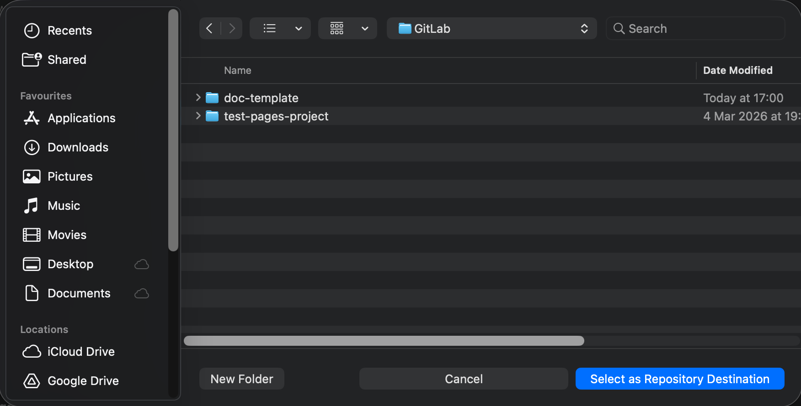
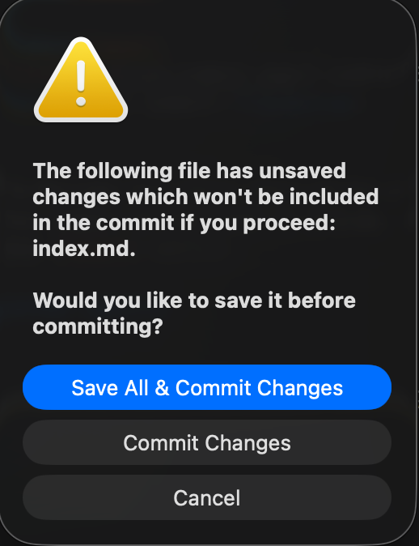
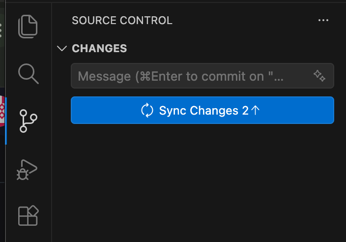
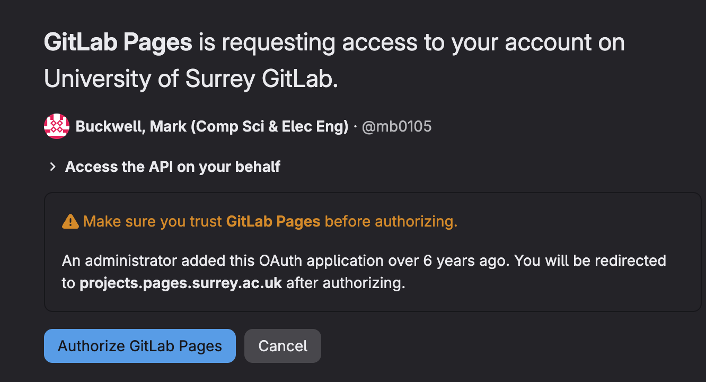

<style>
  /* Reset the page and sidebar to start at 2 */
  .md-typeset { counter-reset: h1-count 1 !important; }
  .md-nav--primary { counter-reset: toc1 2 !important; }
</style>

# Installing the tools

## Setup Visual Studio Code

It's suggested that you use Visual Studio Code with appropriate plugins to edit your static website. Complete the following steps.

1. Register for the [Surrey GitLab instance](https://gitlab.surrey.ac.uk)
1. Start with installing [Visual Studio Code](https://code.visualstudio.com){target="_blank"}. Instructions for macOS and Windows 11 are below:
    <div class="grid cards one-column" markdown>
    
    -   :material-clock-fast:{ .lg .middle } __Install Visual Studio__

        ---

        === "macOS - Standard"

            1. Download the macOS universal zip file from the [official website](https://code.visualstudio.com/).
            2. Open the downloaded `.zip` file to extract the application.
            3. Drag the **Visual Studio Code.app** into your **Applications** folder.

        === "macOS - Homebrew"

            If you use the Homebrew package manager, run this command in your Terminal:
            ``` bash
            brew install --cask visual-studio-code
            ```

        === "Windows 11 - PowerShell"

            Open up a **PowerShell** window and install **Visual Studio Code** using the command:
            ```PowerShell
            winget install Microsoft.VisualStudioCode
            ```

    </div>

2. You will be using the university **GitLab** service at [](https://gitlab.surrey.ac.uk) to store your code. You can communicate with **GitLab** using the `git` command.  macOS can comes with the `git` command installed, but it might be an outdated version. For Windows 11, you will need to install`git`. Follow the instructions below to update or install it.
    <div class="grid cards one-column" markdown>
    
    -   :material-clock-fast:{ .lg .middle } __Install GitLab__

        ---

        === "macOS - Standard"

            Open the **Terminal** application and run the command `xcode-select --install`

        === "macOS - Homebrew"

            If you use the Homebrew package manager, run this command in your Terminal:
            ``` bash
            brew install git
            ```

        === "Windows 11 - PowerShell"

            Open up a **PowerShell** window and install `git` using the command:
            ```PowerShell
            winget install Git.Git
            ```

    </div>

3. Install [markdownlint](https://marketplace.visualstudio.com/items?itemName=DavidAnson.vscode-markdownlint){target="_blank"} plugin for Visual Studio Code. This mardownlint extension checks your markdown files using a library of rules to encourage consistent formatting.
4. Install [Even Better TOML](https://marketplace.visualstudio.com/items?itemName=tamasfe.even-better-toml){target="_blank"} plugin for Visual Studio Code. This extension help manage a [TOML](#download-git-repo-locally){target="_blank"} file.
5. Install [LTeX+–LanguageTool grammar/spell checking](https://marketplace.visualstudio.com/items?itemName=ltex-plus.vscode-ltex-plus){target="_blank"} to enable spelling and grammar checking for Markdown. Configure the plugin in the setting to use the *language* `en-GB`.
6. Install [GitLab](https://marketplace.visualstudio.com/items?itemName=GitLab.gitlab-workflow){target="_blank"} plugin in Visual Studio Code. This will enable you manage your documentation in GitLab.
7. Next configure the *GitLab* plugin to use an OAuth login.

    1. Open the Command Palette:
        1. For macOS, press Command+Shift+P.
        1. For Windows or Linux, press Control+Shift+P.
    1. Type `Preferences: Open User Settings` and press `Enter`.
    1. Select **Settings > Extensions > GitLab > Authentication**.
    1. Under **OAuth Client IDs**, select **Add Item**.
    1. Select **Key** and enter the GitLab instance address [https://gitlab.surrey.ac.uk](https://gitlab.surrey.ac.uk).
    1. Select **Value** and enter your university ID for the OAuth application. For example, `aa0101`.

## Initialise your git repo

1. Create a directory for all your GitLab projects on your local desktop. For example, create a directory called 'GitLab' on your OneDrive. Using OneDrive will give you another backup of your GitLab repository.
2. [Fork a copy of the documentation template](https://gitlab.surrey.ac.uk/mb0105/doc-template/-/forks/new){target="_blank"} to create a copy of the template for your use.
3. Enter the *Project name* using to the format the coursework specifies. For example, for Coursework 1 for the module COMM058 in the year 2026, enter 'comm058-coursework1-2026'. Use all lowercase and a dash between words with no spaces. The project address uses the project name. For example, the project address will be `https://gitlab.surrey.ac.uk/your-username/comm058-coursework1-2026`.
4. Select your personal namespace for the project address.
5. Change the *Visibility Level* to *Private*.
6. Press the button \[Fork Project\] to create your own copy of the project.

    !!! Warning
        Don't forget to set the visibility to private, otherwise other students can see your coursework. Ask another student to check whether they can see your site.

## Download git repo locally

1. Next, download and copy the project into Visual Studio Code so you can work with it locally. Select the **Code**{: .bg-blue} button and a menu will come up. Select the HTTPS button to the right of Visual Studio Code.
2. A browser popup will appear saying 'Open Visual Studio Code?' and you push the **Open Visual Studio Code**{: .bg-blue} button.
3. This will open a directory selection box. Go to the 'GitLab' directory you selected earlier and press the **Select as Repository Destination**{: .bg-blue}. This will then download the code to a subdirectory with the name of the project you created earlier.

    { width="70%" }
    /// caption
    Directory Selection
    ///

4. Next, open your repository that's stored in your 'GitLab' directory. If you already have Visual Studio Code, you may wish to select **Open in a new window**{: .bg-blue} so it creates a separate window to your current workspace.

    { width="40%" }
    /// caption
    Open repository
    ///

## Viewing documentation locally

The great feature of Zensical is that you view the changes to the website locally using a locally hosted website without sending the source to GitLab,

1. Start with installing python and any other software extensions needed. Use the instructions for pip [here](https://zensical.org/docs/get-started/#install-with-pip){target="_blank"} or uv then [here](https://zensical.org/docs/get-started/#install-with-uv){target="_blank"}.
2. With cloning (forking) the site, the configuration work to [create](https://zensical.org/docs/create-your-site/){target="_blank"} and [publish](https://zensical.org/docs/publish-your-site/){target="_blank"} your site to GitLab is already done for you.
3. You can now go to your top-level working directory in your chosen Python environment (virtual environment or uv) and use the preview function documented [here](https://zensical.org/docs/usage/preview/){target="_blank"}.

## Perform initial configuration

1. The zensical.toml file contains the configuration for your website.

2. Make sure you save all your files. A file that needs saving will have a filled circle beside the file name in the explorer tab. Select the file and press Ctrl-S/Cmd-S.

## Synchronise your updates

1. Click on the :gitlab-branch: icon on the left in Visual Studio Code and you will see a list of all the changed and mew files.

    { width="40%" }
    /// caption
    Initial commit
    ///

2. Fill into the Message box short description of the change. In this case, enter 'Initial Commit' as this is the first commit of the code to GitLab.
3. Then press the **Commit**{: .bg-blue} button and select **Save All and Commit Changes**{: .bg-blue}.

    { width="40%" }
    /// caption
    Commit changes
    ///

4. Then sync changes with GitLab

    { width="40%" }
    /// caption
    Sync changes
    ///

## Viewing online website

1. Enter in the address of the website using the form 'https://*namespace*.pages.surrey.ac.uk/*repository-name*'. The address for this template site is [http://mb0105.pages.surrey.ac.uk/doc-template](http://mb0105.pages.surrey.ac.uk/doc-template){target="_blank"}.
2. A box will pop up for you to authorise access for GitLab Pages to gain access to your project to build it.

    { width="40%" }
    /// caption
    Authorise GitLab Pages
    ///

3. You will be redirected to a site [https://doc-template-4f75ad.pages.surrey.ac.uk/](https://doc-template-4f75ad.pages.surrey.ac.uk/){target="_blank"}.

## Release your report

1. Before you release your report, remove the *START HERE* section by commenting it out in the zensical.toml file. Search for START HERE and insert a `#` before the lines between the two comments. You can still get to the information, as it's on the documentation template website [http://mb0105.pages.surrey.ac.uk/doc-template/starthere/starthere](http://mb0105.pages.surrey.ac.uk/doc-template/starthere/starthere){target="_blank"}.

    ``` title="zensical.tomal"
    .
    nav = [
      {"Cover" = [
        "index.md",
      ]},
      {"Originality" = [
        {"Content Originality" = "originality.md"}
      ]},
      {"Assignment" = [
        {"Section 1" = "section1.md"},
        {"Section 2" = "section2.md"},
        {"Section 3" = "section3.md"},
        {"Section 4" = "section4.md"}
# Comment out the START HERE section (5 lines) before releasing your report, as it contains instructions for the author and isn't meant for the reader of the report
      ]},
      {"START HERE" = [
        {"1. Start Here" = "starthere/starthere.md"},
        {"2. Installing the Tools" = "starthere/installation.md"},
        {"3. Markdown in 5min" = "starthere/markdown.md"},
        {"4. Zensical basics" = "starthere/zensicalbasics.md"},
        {"5. Shell commands" = "starthere/shcommands.md"}
# Comment until here before releasing your report, as it contains instructions for the author and isn't meant for the reader of the report
      ]}
    ]
    ```

## Install vale

## Install zensical studio
